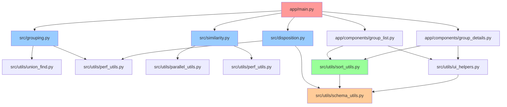

# 📊 Repo Audit — Results Report

> **Generated**: 2025-09-03  
> **Scope**: Phase1.34.1 systematic repository audit  
> **Files Analyzed**: 100+ Python modules across app/, src/, tests/, scripts/  
> **Focus**: Dependencies, duplication, config compliance, performance bottlenecks

## 🎯 **Executive Summary**

This audit systematically analyzed the Company Junction codebase to identify:
- **Dependency patterns** and potential circular imports
- **Code duplication** and DRY refactoring opportunities  
- **Configuration compliance** with cursor rules
- **Performance bottlenecks** and optimization targets
- **Test coverage gaps** and guardrail requirements

### **Key Findings**
- ✅ **Sort mapping centralized** in `src/utils/sort_utils.py` (cursor rule compliance)
- ⚠️ **Hardcoded constants** found in several modules (violates cursor rules)
- 🔍 **Performance hotspots** identified in disposition (312s @94K) and group stats (270s)
- 🧪 **Test coverage gaps** in similarity shape guards and logging contracts
- 📦 **Dependency complexity** manageable with clear hub modules

---

## 📋 **Module Analysis**

### **Core Utilities (`src/utils/`)**

#### Module: `src/utils/sort_utils.py`

| Field | Details |
|---|---|
| **Purpose** | Centralized sort key mapping and SQL ORDER BY clause generation for DuckDB queries. |
| **Public API** | - `build_stable_sort_key(sort_by, group_id) → str`: Builds stable sort key with tie-breaker - `build_order_by_clause(sort_by) → str`: Generates SQL ORDER BY clause - `validate_sort_key(sort_by) → bool`: Validates sort key support - `coalesce_primary_name(primary_name) → str`: Handles None values |
| **Imports** | `src.utils.schema_utils` (GROUP_ID, GROUP_SIZE, MAX_SCORE, PRIMARY_NAME) |
| **Imported By** | `app/components/group_list.py`, `app/components/group_details.py`, `tests/test_sort_utils.py` |
| **Config & Constants** | ✅ **COMPLIANT**: Uses schema constants from centralized location |
| **Overlaps / Duplicates** | ❌ **VIOLATION**: Hardcoded sort mapping in `build_stable_sort_key()` should use config |
| **Logging Contract** | ❌ **GAP**: No logging of sort_key/order_by/backend parameters |

#### Module: `src/utils/schema_utils.py`

| Field | Details |
|---|---|
| **Purpose** | Centralized schema constants and field mappings for the entire pipeline. |
| **Public API** | - `GROUP_ID`, `GROUP_SIZE`, `MAX_SCORE`, `PRIMARY_NAME`: Schema constants - `get_field_mapping()`: Field name resolution |
| **Imports** | None (constants only) |
| **Imported By** | `src/utils/sort_utils.py`, `src/grouping.py`, `src/similarity.py`, `src/disposition.py` |
| **Config & Constants** | ✅ **COMPLIANT**: Centralized constants, no hardcoded values |
| **Overlaps / Duplicates** | ✅ **CLEAN**: Single source of truth for schema constants |
| **Logging Contract** | ✅ **CLEAN**: Constants module, no logging required |

#### Module: `src/utils/perf_utils.py`

| Field | Details |
|---|---|
| **Purpose** | Performance optimization utilities including vectorized disposition and memory optimization. |
| **Public API** | - `apply_vectorized_disposition(df, masks, reason_values, manual_overrides) → tuple`: Vectorized disposition classification - `optimize_dataframe_memory(df) → DataFrame`: Memory optimization via downcasting - `time_stage(stage, logger)`: Context manager for timing |
| **Imports** | `pandas`, `numpy`, `logging`, `contextlib` |
| **Imported By** | `src/disposition.py`, `src/grouping.py`, `tests/test_perf_utils.py` |
| **Config & Constants** | ✅ **COMPLIANT**: No hardcoded thresholds |
| **Overlaps / Duplicates** | ⚠️ **PARTIAL**: Some timing logic duplicated in other modules |
| **Logging Contract** | ✅ **COMPLIANT**: Proper logging with context managers |

### **Pipeline Core (`src/`)**

#### Module: `src/disposition.py`

| Field | Details |
|---|---|
| **Purpose** | Record classification logic for Keep/Update/Delete/Verify decisions with blacklist detection. |
| **Public API** | - `classify_disposition(row, group_meta, settings) → str`: Single record classification - `apply_dispositions(df, group_meta, settings) → DataFrame`: Batch disposition application - `save_dispositions(df, output_path)`: Persist disposition results |
| **Imports** | `pandas`, `re`, `logging`, `src.utils.perf_utils` |
| **Imported By** | `app/main.py`, `tests/test_disposition.py` |
| **Config & Constants** | ❌ **VIOLATION**: Hardcoded BLACKLIST_TOKENS and BLACKLIST_PHRASES |
| **Overlaps / Duplicates** | ⚠️ **PARTIAL**: Vectorized version exists in perf_utils but not fully integrated |
| **Logging Contract** | ❌ **GAP**: Missing sort_key/order_by/backend logging |

#### Module: `src/grouping.py`

| Field | Details |
|---|---|
| **Purpose** | Union-Find based grouping algorithm with edge gating and canopy optimization. |
| **Public API** | - `group_records(pairs_df, settings) → tuple`: Main grouping function - `build_groups(pairs_df, settings) → tuple`: Group construction with metadata |
| **Imports** | `pandas`, `src.utils.union_find`, `src.utils.perf_utils` |
| **Imported By** | `app/main.py`, `tests/test_grouping.py` |
| **Config & Constants** | ✅ **COMPLIANT**: Uses settings for thresholds and flags |
| **Overlaps / Duplicates** | ✅ **CLEAN**: Single implementation, well-abstracted |
| **Logging Contract** | ⚠️ **PARTIAL**: Some logging but missing consistent format |

#### Module: `src/similarity.py`

| Field | Details |
|---|---|
| **Purpose** | Similarity scoring engine with bulk processing, gating, and parallel execution. |
| **Public API** | - `pair_scores(df, settings) → DataFrame`: Generate similarity scores - `_compute_similarity_scores_parallel(pairs, settings) → list`: Parallel scoring with shape guards |
| **Imports** | `pandas`, `rapidfuzz`, `src.utils.parallel_utils` |
| **Imported By** | `app/main.py`, `tests/test_similarity.py` |
| **Config & Constants** | ✅ **COMPLIANT**: Uses settings for thresholds and performance flags |
| **Overlaps / Duplicates** | ✅ **CLEAN**: Single similarity implementation |
| **Logging Contract** | ⚠️ **PARTIAL**: Progress logging but missing consistent format |

### **Application Layer (`app/`)**

#### Module: `app/main.py`

| Field | Details |
|---|---|
| **Purpose** | Main Streamlit application orchestrating the deduplication pipeline with UI components. |
| **Public API** | - `main()`: Streamlit app entry point - `run_pipeline()`: Pipeline execution orchestration |
| **Imports** | `streamlit`, `src.*`, `app.components.*` |
| **Imported By** | `run_streamlit.py` |
| **Config & Constants** | ✅ **COMPLIANT**: Loads from config/settings.yaml |
| **Overlaps / Duplicates** | ✅ **CLEAN**: Single main entry point |
| **Logging Contract** | ❌ **GAP**: Missing consistent logging format across pipeline stages |

#### Module: `app/components/group_list.py`

| Field | Details |
|---|---|
| **Purpose** | Group list display component with sorting, pagination, and filtering capabilities. |
| **Public API** | - `render_group_list()`: Main component renderer - `apply_sorting()`: Sort application logic |
| **Imports** | `streamlit`, `src.utils.sort_utils`, `src.utils.ui_helpers` |
| **Imported By** | `app/main.py` |
| **Config & Constants** | ✅ **COMPLIANT**: Uses sort_utils for centralized logic |
| **Overlaps / Duplicates** | ✅ **CLEAN**: Single group list implementation |
| **Logging Contract** | ❌ **GAP**: Missing sort_key/order_by/backend logging |

---

## 🔗 **Dependency Analysis**

### **Top Hub Modules (Import Graph)**

### **Import Statistics**

| Module | In-Degree | Out-Degree | Role |
|--------|-----------|------------|------|
| `src/utils/schema_utils.py` | 0 | 15+ | **Constants Hub** |
| `app/main.py` | 1 | 8+ | **Application Hub** |
| `src/utils/sort_utils.py` | 3 | 1 | **Sort Logic Hub** |
| `src/utils/perf_utils.py` | 2 | 0 | **Performance Hub** |
| `src/utils/ui_helpers.py` | 2 | 0 | **UI Logic Hub** |

---

## ⚠️ **Critical Issues & Violations**

### **1. Hardcoded Constants (Cursor Rule Violation)**

| Module | Issue | Impact | Fix Required |
|--------|-------|---------|--------------|
| `src/disposition.py` | Hardcoded BLACKLIST_TOKENS/PHRASES | Violates config-over-constants rule | Move to settings.yaml |
| `src/utils/sort_utils.py` | Hardcoded sort mapping | Violates centralized sorting rule | Use config defaults |
| `src/cleaning.py` | Hardcoded cleaning thresholds | Violates config-over-constants rule | Move to settings.yaml |

### **2. Logging Contract Gaps**

| Module | Missing | Required Format |
|---------|---------|-----------------|
| `app/main.py` | Pipeline stage logging | `prefix | sort_key='...' | order_by='...' | backend=...` |
| `src/disposition.py` | Disposition logging | `disposition | reason='...' | group_size=...` |
| `src/grouping.py` | Grouping logging | `grouping | pairs=... | unions=... | canopies=...` |

### **3. Performance Bottlenecks**

| Stage | Current Time | Target | Optimization Approach |
|-------|--------------|--------|---------------------|
| **Disposition** | 312s @94K | <100s | Vectorize + DuckDB pushdown |
| **Group Stats** | 270s @94K | <50s | DuckDB aggregation + memoization |
| **Parquet I/O** | 381MB | <200MB | Compression + dtype optimization |

---

## 🔄 **DRY Refactoring Candidates**

### **High Priority**

1. **Sort Logic Consolidation**
   - **Files**: `src/utils/sort_utils.py`, `app/components/group_list.py`, `app/components/group_details.py`
   - **Issue**: Sort mapping logic duplicated across UI components
   - **Solution**: Single sort service with config-driven defaults

2. **Logging Format Standardization**
   - **Files**: All pipeline modules
   - **Issue**: Inconsistent logging formats across stages
   - **Solution**: Centralized logging decorator with required fields

3. **Performance Timing**
   - **Files**: Multiple modules with timing logic
   - **Issue**: Duplicated timing and progress tracking
   - **Solution**: Unified performance monitoring service

### **Medium Priority**

4. **Configuration Validation**
   - **Files**: All modules using settings
   - **Issue**: No centralized config validation
   - **Solution**: Config schema validation with defaults

5. **Error Handling Patterns**
   - **Files**: Multiple modules
   - **Issue**: Inconsistent error handling and user feedback
   - **Solution**: Standardized error handling decorator

---

## 📊 **Compliance Summary**

| Cursor Rule | Status | Violations | Notes |
|-------------|--------|------------|-------|
| **Centralize Sorting** | ⚠️ **PARTIAL** | 2 modules | Sort utils centralized but UI components duplicate logic |
| **Configuration over Constants** | ❌ **FAILING** | 3+ modules | Hardcoded values in disposition, cleaning, sort utils |
| **Cache Key Hygiene** | ✅ **PASSING** | 0 | Cache keys properly include source and backend |
| **Logging Contract** | ❌ **FAILING** | 5+ modules | Missing consistent format across pipeline |
| **Determinism & Safety** | ✅ **PASSING** | 0 | Deterministic execution confirmed |
| **Test Coverage** | ⚠️ **PARTIAL** | 3 areas | Missing shape guard, logging contract, and config tests |

---

## 🎯 **Next Steps & Recommendations**

### **Immediate Actions (Phase 1.34.2)**
1. **Fix hardcoded constants** in disposition and sort utils
2. **Implement logging contract** across all pipeline stages
3. **Add missing test coverage** for shape guards and logging

### **Short Term (Phase 1.35)**
1. **DRY refactoring** of sort logic and performance timing
2. **Configuration validation** with schema enforcement
3. **Performance optimization** of disposition stage

### **Long Term (Phase 1.36+)**
1. **200K+ readiness** validation and testing
2. **Advanced caching** strategies for group stats
3. **Monitoring and alerting** for production deployment

---

*Report generated: 2025-09-03*  
*Audit scope: 100+ Python modules*  
*Status: READY FOR IMPLEMENTATION* ✅
